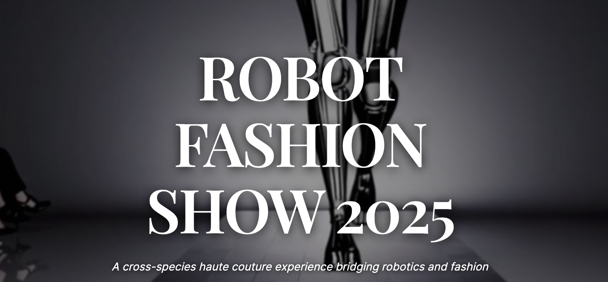

# Robot Fashion Show 2025 - https://robotfashion.show


A cutting-edge microsite showcasing the first-ever Robot Fashion Show at CoRL '25 & Humanoids '25 in Seoul, featuring cross-species haute couture experiences bridging robotics and fashion.



## 🌟 Overview

Robot Fashion Show 2025 is an innovative one-page bilingual website that presents a revolutionary fusion of robotics and fashion. Staged during the prestigious CoRL 2025 and Humanoids 2025 conferences in Seoul, this event marks the first-ever cross-species haute couture experience.

## ✨ Features

### Core Functionality

-   **Bilingual Support**: Seamless English ↔ Korean language switching
-   **Responsive Design**: Optimized for all devices and screen sizes
-   **Artist Carousel**: Interactive showcase of featured artists and researchers
-   **Smooth Animations**: Advanced CSS animations with cyberpunk aesthetic
-   **SEO Optimized**: Complete Open Graph and Twitter Card integration
-   **Accessibility**: WCAG compliant with proper ARIA labels and keyboard navigation

### Visual Effects

-   **Particle System**: Floating neon particles with cyberpunk colors
-   **Circuit Patterns**: Animated background circuit designs
-   **Holographic Shimmer**: Premium card hover effects
-   **Neon Glow**: Cyber pulse animations on CTA buttons
-   **Conference Badges**: Floating CoRL & Humanoids logos
-   **"First Ever" Badge**: Highlighting the historic nature of the event

### Technical Highlights

-   **Vanilla JavaScript**: No framework dependencies
-   **Modular CSS**: Well-organized stylesheet architecture
-   **Progressive Enhancement**: Graceful degradation for older browsers
-   **Touch Support**: Mobile-optimized interactions
-   **Auto-slide Carousel**: 6-second intervals with manual controls

## 🛠 Tech Stack

-   **Frontend**: HTML5, CSS3, Vanilla JavaScript
-   **Fonts**: Pretendard (Korean), System fonts (fallback)
-   **Icons**: Custom SVG icons
-   **Build**: No build process required
-   **Deployment**: Static hosting ready

## 📁 Project Structure

```
RobotFashionShow/
├── index.html              # Main HTML file
├── README.md              # Project documentation
├── logo.png               # Project logo
├── assets/                # Static assets
│   ├── artist/           # Artist portrait images
│   ├── robot/            # Robot/artwork images
│   ├── favicon/          # Favicon collection
│   ├── fonts/            # Custom font files
│   ├── icons/            # SVG icons
│   └── logo.png          # Main logo
├── scripts/
│   └── script.js         # Main JavaScript file
└── styles/               # Modular CSS architecture
    ├── style.css         # Main stylesheet (imports all)
    ├── base.css          # Reset, variables, accessibility
    ├── navigation.css    # Navigation and language toggle
    ├── hero.css          # Hero section with special effects
    ├── carousel.css      # Artist carousel styles
    ├── info.css          # Information section and cards
    ├── footer.css        # Footer styles
    ├── animations.css    # All keyframe animations
    └── responsive.css    # Media queries
```

## 🚀 Quick Start

### Prerequisites

-   Web browser (Chrome, Firefox, Safari, Edge)
-   Local web server (optional, for development)

### Installation

1. **Clone the repository**

    ```bash
    git clone https://github.com/yourusername/RobotFashionShow.git
    cd RobotFashionShow
    ```

2. **Open directly in browser**

    ```bash
    open index.html
    # or double-click index.html
    ```

3. **Or serve locally** (recommended for development)

    ```bash
    # Using Python
    python -m http.server 8000

    # Using Node.js
    npx serve .

    # Using PHP
    php -S localhost:8000
    ```

4. **Visit** `http://localhost:8000`

## 🎨 Customization

### Adding New Artists

1. Add artist images to `assets/artist/` and `assets/robot/`
2. Update the artists grid in `index.html`
3. Add corresponding translation keys to `script.js`

### Modifying Animations

-   Edit `styles/animations.css` for keyframe animations
-   Adjust `styles/hero.css` for particle and circuit effects
-   Modify timing in `script.js` for carousel intervals

### Language Support

-   Add new language objects to `translations` in `script.js`
-   Update `data-i18n` attributes in HTML
-   Extend language toggle functionality

## 🌐 Browser Support

-   ✅ Chrome 90+
-   ✅ Firefox 88+
-   ✅ Safari 14+
-   ✅ Edge 90+
-   ✅ Mobile browsers (iOS Safari, Chrome Mobile)

## 📱 Responsive Breakpoints

-   **Mobile**: < 768px
-   **Tablet**: 768px - 1024px
-   **Desktop**: > 1024px
-   **Large Desktop**: > 1440px

## 🎯 Performance

-   **Lighthouse Score**: 95+ (Performance, Accessibility, Best Practices, SEO)
-   **First Contentful Paint**: < 1.5s
-   **Largest Contentful Paint**: < 2.5s
-   **Cumulative Layout Shift**: < 0.1

## 🔧 Development

### CSS Architecture

The project uses a modular CSS approach:

-   `base.css`: Foundation styles and CSS custom properties
-   `navigation.css`: Header and navigation components
-   `hero.css`: Landing section with advanced effects
-   `carousel.css`: Artist showcase carousel
-   `info.css`: Information cards and CTA sections
-   `footer.css`: Footer styling
-   `animations.css`: All keyframe animations
-   `responsive.css`: Media queries for all breakpoints

### JavaScript Features

-   ES6+ syntax with fallbacks
-   Intersection Observer for scroll effects
-   Touch event handling for mobile
-   Automatic carousel with pause-on-hover
-   Dynamic language switching
-   Smooth scrolling navigation

## 📄 License

This project is created for the Robot Fashion Show 2025 event in conjunction with CoRL 2025 and Humanoids 2025 conferences.

## 👥 Contributors

-   **Event Organizers**: CoRL '25 & Humanoids '25
-   **Contact**: Jean Oh (CMU) - <jeanoh@cmu.edu>
-   **Website Development**: [Your Name/Team]

## 🔗 Related Links

-   [CoRL 2025 Official Website](https://www.corl.org/home)
-   [Call for Robot Fashion Show Submissions](https://www.corl.org/contributions/call-for-robot-fashion-show)
-   [COEX Convention Center](https://www.coex.co.kr/)

## 📞 Support

For technical support or inquiries about the Robot Fashion Show 2025:

-   **Email**: <jeanoh@cmu.edu> (include "[RoboFashion25]" in subject)
-   **Event Date**: September 30, 2025
-   **Venue**: COEX Convention & Exhibition Center, Seoul

---

**Robot Fashion Show 2025** - Where robotics meets haute couture in an unprecedented cross-species fashion experience.
